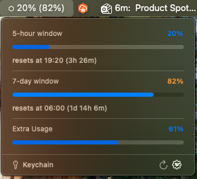

# Claude Usage Widget

A native macOS menu bar widget that shows your Claude.ai usage windows (5-hour, 7-day, and any additional caps) at a glance.




## Features

- Live usage percentages in the menu bar with color-coded warnings
- Countdown timers showing when each usage window resets
- Automatic session detection from Safari, Firefox, and Chrome/Brave cookies
- Built-in login flow with Keychain storage when browser cookies aren't available
- Auto-discovers your organisation ID from the Claude API
- Refreshes every 60 seconds
- Nix flake with a home-manager module for declarative installation

## Install

### Quick (build from source)

Requires macOS 13+ and Xcode Command Line Tools (`xcode-select --install`).

```bash
git clone https://github.com/JayanSmart/claude-usage-widget.git
cd claude-usage-widget
bash install.sh
```

### DMG (share with teammates)

```bash
bash dist.sh
```

This produces a `ClaudeUsage.dmg` that anyone can drag-install. On first launch, right-click the app and choose Open to bypass Gatekeeper.

### Nix flake

Add as a flake input and import the home-manager module:

```nix
# flake.nix
inputs.claude-usage = {
  url = "github:JayanSmart/claude-usage-widget";
  inputs.nixpkgs.follows = "nixpkgs";
  inputs.home-manager.follows = "home-manager";
};

# In your home-manager config modules list:
inputs.claude-usage.homeManagerModules.default
```

This installs the app to `~/Applications`, creates a LaunchAgent for auto-start, and manages updates declaratively.

## How it works

The widget reads your Claude.ai session cookie from the macOS Keychain (set via the built-in login flow) or from browser cookie databases (Firefox, Chrome, Brave). It then calls the Claude.ai usage API to fetch your current utilization across all rate-limit windows.

No data is sent anywhere except `claude.ai`. The session key never leaves your machine.

## License

MIT
